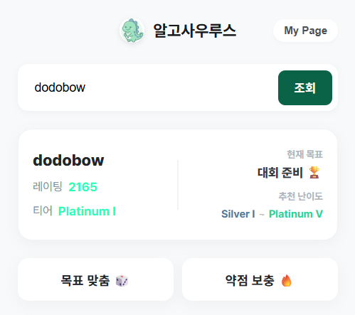
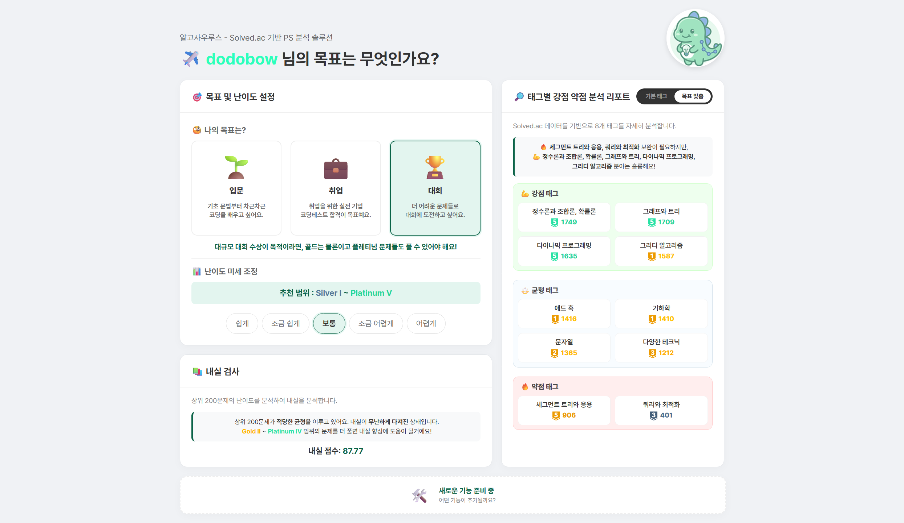

# 🌳🦖 알고사우루스 (Algosaurus) 🦕🌴

> Solved.ac 데이터를 활용하여 나에게 딱 맞는 알고리즘 문제를 추천해주는 PS계의 포식자. **알고사우루스!**

무슨 문제를 풀어야 할까? 어떤 자료구조와 알고리즘을 공부해야 하지?  
알고사우루스는 사용자의 **Solved.ac 티어와 목표를 분석**하여 **적당한 난이도와 태그**를 보여주고 풀기 **좋은 문제를 추천**해줍니다.

 

## ✨ 주요 기능 (Key Features)

- **🧩 맞춤형 문제 추천** - 이제 문제 난이도 고민은 그만!
  - 사용자의 Solved.ac 티어와 목표를 기반으로 적절한 난이도의 문제를 추천합니다.
  - 공부 목적(입문, 취업, 대회)에 따라 추천 범위를 자동으로 보정합니다.
  - 사용자의 약점을 보완하기 위한 문제도 추천받을 수 있습니다.

- **📚 목표별 10대 태그 그룹** - 목표에 따른 자세한 태그 분석!
  - 목표를 위한 주요 태그들을 10개의 그룹으로 묶어 강점 / 균형 / 약점으로 나누어 분석합니다.
  - 기존 Solved.ac 8대 태그의 부족한 점을 보완했습니다.
  - 어떤 자료구조, 알고리즘을 공부할지 방향성을 제시합니다. 

- **📊 섬세한 난이도 조절** - 스스로 조절해가며 찾아가는 적정 수준
  - "조금 더 쉽게", "조금 더 어렵게"와 같은 옵션을 통해, 추천 범위를 미세 조정할 수 있습니다.
  - 옵션 변경 시 추천되는 티어 범위를 실시간으로 확인 할 수 있습니다.

 

## 📸 스크린샷 (Screenshots)

| **팝업 메인 (Popup)** | **설정 페이지 (Options)** |
|:---:|:---:|
|  |  |
| 내 티어 확인 및 문제 뽑기 | 목표 설정 및 난이도 조절 |

 

## 🚀 설치 및 실행 방법 (Installation)

이 프로젝트는 현재 크롬 웹 스토어에 등록되지 않았으며, **개발자 모드**를 통해 설치할 수 있습니다.

1. 이 저장소를 다운로드하거나 클론(Clone)합니다.
2. 크롬 브라우저 주소창에 `chrome://extensions/`를 입력하여 이동합니다.
3. 우측 상단의 **'개발자 모드(Developer mode)'** 스위치를 켭니다.
4. 좌측 상단의 **'압축 해제된 확장 프로그램을 로드합니다(Load unpacked)'** 버튼을 클릭합니다.
5. 다운로드 받은 프로젝트 폴더(`PS-Helper`)를 선택합니다.

 

## 🛠️ 기술 스택 (Tech Stack)

- **Frontend:** HTML, CSS, JavaScript (Vanilla)
- **API:** [Solved.ac API](https://solvedac.github.io/unofficial-documentation/)
- **Platform:** Chrome Extension Manifest V3

 

## 📝 License

This project is licensed under the MIT License.
